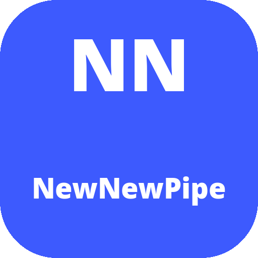

<hr>
<p align="center"></p>
<h2 align="center"><b>NewNewPipe</b></h2>
<h4 align="center">Fork personale di PipePipe: NewPipe, reimagined.</h4>
<hr>

## Cos'è

**NewNewPipe** è un fork personale di [PipePipe](https://github.com/InfinityLoop1308/PipePipe) (v5.2.5), che a sua volta è un hard fork di NewPipe.

Rispetto all'upstream questo fork:
* ha un package applicativo proprio (`org.newnewpipe.app`) e un namespace Kotlin rinominato (`org.newnewpipe.app` / `org.newnewpipe.extractor`);
* vive **tutto in questa singola repo**: client, extractor e librerie sono qui dentro, senza submodule e senza dipendenze da altre repository (le dipendenze Maven standard restano quelle di Gradle);
* ha una propria icona e nome applicazione.

## Funzionalità esclusive di NewNewPipe

Oltre a quanto ereditato da PipePipe, questo fork aggiunge:

#### Casting TV (DLNA + Chromecast)
* **DLNA** tramite jupnp: scoperta dispositivi, DIDL-Lite, controllo riproduzione (play/pause/seek/volume) via AVTransport/RC
* **Chromecast** tramite Cast SDK (gate Google Play): sessione, queue transport con mappatura della PlayQueue, MediaRouteButton nel player

#### Sincronizzazione tra dispositivi (WebDAV)
* Client WebDAV nativo su OkHttp (`sync/WebDavClient.kt`) — PROPFIND / GET / PUT / MKCOL / DELETE, HTTPS obbligatorio
* Sincronizzazione di abbonamenti, cronologia e playlist tra più dispositivi via Nextcloud/ownCloud/pCloud o qualsiasi server WebDAV, con **merge per entità e last-write-wins** (timestamp epoch-ms)
* Credenziali cifrate (EncryptedSharedPreferences + Keystore), cifratura blob opzionale AES-256-GCM, sync periodico via WorkManager + trigger manuale, primo sync = upload locale

#### Auto-failover istanze PeerTube
* Health check dell'istanza attiva (`GET /api/v1/config`) con timeout OkHttp
* Switch automatico alla prossima istanza sana con backoff esponenziale e notifica
* Rispetta la scelta manuale dell'utente e ripiega sull'istanza di default

#### Testi sincronizzati (lyrics) + scrobbling
* Fetch testi da **lrclib** (gratis, senza API key) con cache per brano
* **Overlay sincronizzato** nel music player: testo scorre con la posizione media3 (ricerca binaria), tap per pausa sullo scroll
* **Scrobbling Last.fm**: handshake MD5 e invio scrobble al raggiungimento della soglia (50% di riproduzione o 4 minuti), retry con backoff, disattivabile dalle impostazioni

#### Android Auto
* Browse con 4 categorie (Playlists, Subscriptions, Feed, History) + live update
* Style hint per la head unit (LIST_ITEM/GRID_ITEM), **play-from-search e play-from-URI** reali, shuffle nativa, azioni dinamiche (next/prev solo se esiste l'adiacente), validazione del package client

#### Watch together
* Server WebSocket **embedded self-hosted** (porta 8420, stanze `/watch/<roomId>`) + protocollo JSON (join/leave/state/seek)
* Client nel player: crea/unisci stanza con codice a 4 caratteri, sync **master-slave** con estrapolazione della posizione (tolleranza 2s), promozione host al leave, barra partecipanti

#### UI moderna — Jetpack Compose + Material You
* Tema unico in Compose (`theme/NewNewPipeTheme.kt`): **dynamic color su Android 12+** con fallback palette indaco del fork (varianti light/dark/black)
* Feed, subscriptions, ricerca e **commenti** migrati a Compose per default (switch di opt-out mantenuto nelle impostazioni)
* Applicazione progressiva del dynamic color anche ai View legacy su API 31+

## Funzionalità principali (da PipePipe)

#### YouTube Enhancements
* Integrate SponsorBlock per saltare i segmenti sponsorizzati (YouTube & BiliBili)
* Ripristina i dislike di YouTube con ReturnYouTubeDislike
* Mostra i titoli originali su YouTube (non localizzati)
* Login per contenuti riservati o premium

#### Media Features
* Chat live in overlay stile danmaku
* Supporto codec AV1 e VP9
* Modalità music player con riproduzione in background

#### Filtering
* Filtri di ricerca avanzati
* Filtro contenuti per parole chiave o canali
* Blocco di shorts e video a pagamento

#### Playback Controls
* Swipe-to-seek e gesture a schermo intero
* Long-press per velocizzare la riproduzione
* Sleep timer

#### Enhanced Playlists
* Download di playlist complete
* Ricerca e ordinamento in playlist e cronologie locali

... e molte altre!

## Build

Requisiti: JDK 25+, Android SDK (compileSdk 37). La struttura è appiattita: la build si lancia dalla root della repo.

```bash
./gradlew :app:assembleDebug
```

L'APK viene prodotto in `app/build/outputs/apk/debug/`. Il client dipende dall'extractor locale tramite composite build (`includeBuild('extractor')`): nessun fetch di JitPack per l'extractor.

## Dipendenze di servizio esterne (runtime)

Alcune funzionalità usano servizi di terze parti a runtime (non inclusi in questa repo):
* decodifica firma/parametro-n di YouTube: API upstream `https://api.pipepipe.dev/decoder/decode`
* SponsorBlock: API pubblica di SponsorBlock

## API key di YouTube (Innertube) — tenute volutamente

Nel codice sono presenti alcune chiavi `AIza...` (`YoutubeParsingHelper.java`,
`LocalDomPoTokenRequest.kt`). **Non sono chiavi personali né Google Cloud**:
sono le chiavi *client* di YouTube stesso (Android/iOS/web), già pubbliche nel
repo upstream di PipePipe e in tutto l'ecosistema NewPipe da anni. Vengono
inviate a ogni richiesta all'API InnerTube: senza di esse l'estrazione video
non funziona. Si è deciso di tenerle invariate; chi vuole sostituirle può
farlo, ma la funzionalità YouTube ne dipende.

## Licenza

GPLv3 — vedi [LICENSE](LICENSE). Il progetto deriva da [PipePipe](https://github.com/InfinityLoop1308/PipePipe) (GPLv3), a sua volta derivato da [NewPipe](https://github.com/TeamNewPipe/NewPipe).

## Crediti

* [PipePipe](https://github.com/InfinityLoop1308/PipePipe) — il progetto da cui questo fork deriva
* [NewPipe](https://github.com/TeamNewPipe/NewPipe) — il progetto originale
